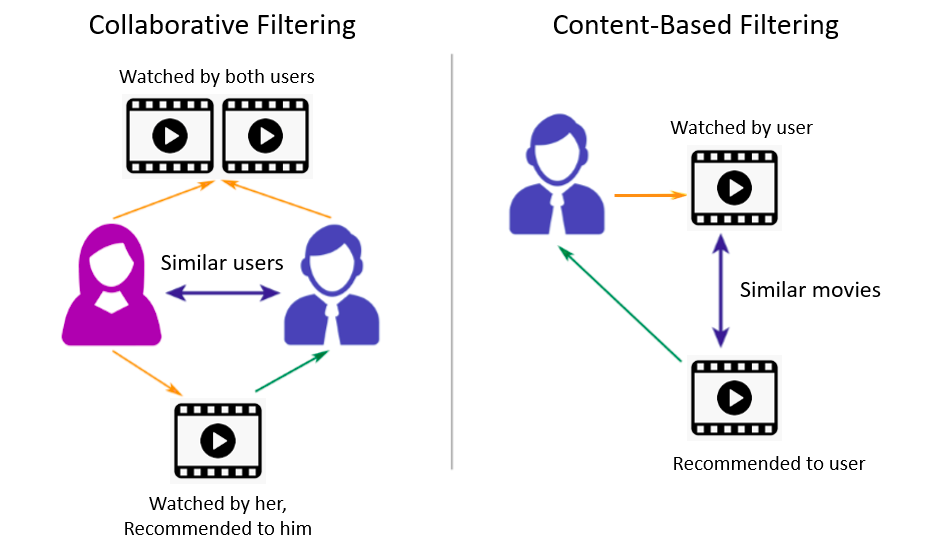

## Movie recommendation system
Recommendation system has long become an essential part of any business and e-commerce. It plays an important role in not only supporting customers making optimal 
decisions, but also improving business operations.

Whether you want to introduce people among themselves in your social network, try to recommend a similarly purchased item to the customers, 
or need a hint for yourself which movie to watch in the evening, there are unlimited possibilities to apply recommendation engine/system around us.

In this project, we will explore and compare different algorithms and approaches to movie recommendation.

### About recommendation system
Recommender systems are one of the most successful and widespread applications of machine learning technologies in business. Recommendation systems help to increase 
business efficiency and help customers to find the most suitable product for them.

There are 3 main types of recommendation system: popularity-based, content-based, and collaborative filtering.

* **Popularity-based filtering**: This is the most simple method of creating a recommendation engine. The recommendation is purely made based on 
the rating of a particular movie, how popular that movie is among all users. The system will recommend the most popular movies to all individuals. 
Think about if you look on Netflix, this will be "Most popular" recommendation section. Although this recommendation engine is simple to implement, 
it doesn't allow customizations for viewers.

* **Content-based filtering**: This filtering is based on the description or the characteristic of product. The system finds the similarity between products 
based on its context or description. The user’s previous history is taken into account to find similar products the user may like. 
For example, if a user likes movies such as ‘Mission Impossible’ then we can recommend him/her the movies that have ‘Tom Cruise’ or movies with the 
genre ‘Action’. Think of it as "Recommended for your_name" on Netflix

* **Collaborative filtering**: This is a technique that can filter out movies that a user might like on the basis of reactions by similar viewers. 
It is based on the idea that people who agreed in their evaluation of certain movies in the past are likely to agree again in the future. 
Think of it this way: A and B both rate "Toy Story" 5 star and "Fast and Furious" 3 star. If A watched and liked "Mission Impossible", 
then the system would recommend it to B.

In this project, we'll try and implement all 3 recommender systems above. We'll use a variety of technique and algorithm to build our recommendion engine.

### About the dataset
This dataset with its multiple files contains 26 million ratings from 270,000 users for all 45,000 movies. Ratings are on a scale of 1-5 and 
have been obtained from the official GroupLens website. The dataset consists of movies released on or before July 2017. Data points include cast, crew, 
plot keywords, budget, revenue, posters, release dates, languages, production companies, countries, TMDB vote counts and vote averages.

### Project content

I. Import libraries and load the dataset (data cleaning, data imputation, feature extraction)

II. Exploratory Data Analysis (variable analysis, feature transformation)

III. Build recommendation system:

* Popularity-based recommender using weighted rating
* Content-based recommender using cosine similarity
* Content-based recommender using Kmeans and Gaussian Mixture Model(GMM)
* Collaborative filtering using Pearson correlation
* Collaborative filtering using K-nearest neighbor
